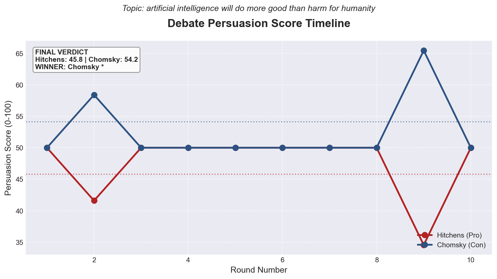
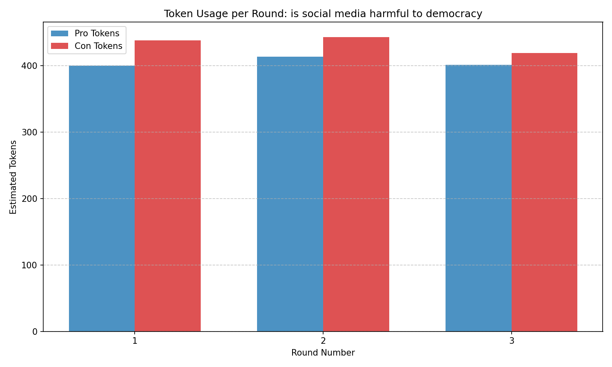
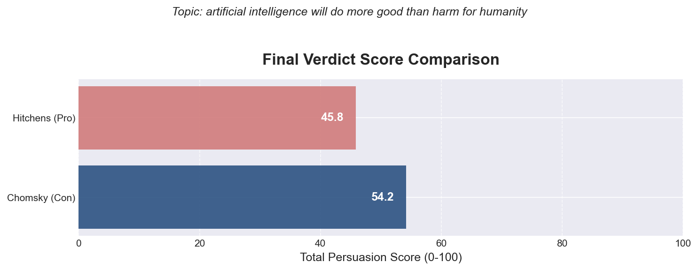

# Multi-Agent AI Debate System: Hitchens vs Chomsky

*A fully autonomous, multi-agent debate framework where highly-opinionated AI personas battle over complex topics.*


## What It Is
Just type a topic, and watch Christopher Hitchens and Noam Chomsky debate it using live web research to source their claims. The entire debate is rigorously scored by Justice Ruth Bader Ginsburg, who acts as the impartial Master Agent determining the final winner based on rhetorical strength, logic, and evidence quality.

## Key Features
- **Famous Personas:** Hitchens (aggressive, evidence-demanding) vs Chomsky (systemic, institutional critique) vs RBG (fair, structured judge).
- **Real Web Search:** Agents dynamically search the internet to back their arguments with real-time empirical evidence.
- **Dynamic Role Assignment:** The system decides which persona takes Pro and Con based on the topic.
- **Impartial Judging:** RBG evaluates 4 strict dimensions with no ties allowed.
- **Star-Topology Multiprocessing:** Secure, isolated concurrent processes where children can only communicate with the Master agent.
- **Cost Tracking:** Built-in token budget management and projection analysis.
- **Free Replays:** Render the beautiful rich-text terminal UI from saved transcripts without hitting the API.

## Demo / Showcase
We ran a full 10-round debate on *"artificial intelligence will do more good than harm for humanity"*. **Con won 54.2 to 45.8.**

### Justice Ginsburg's Final Verdict
> *"Con wins because Pro conflates theoretical potential with demonstrated reality. While Pro correctly identifies real productivity gains and wage premiums for AI-skilled workers, Con effectively exposes the logical flaw: these benefits accrue to those already positioned to capture them, while institutions designed to redistribute gains remain unbuilt. Pro's entire case depends on Phase III pharmaceutical trials arriving in 2026 to validate efficacy—yet even if successful, one approval does not prove systematic benefit. Con maintains evidentiary discipline throughout, acknowledging genuine wage and productivity data while demonstrating why their concentration among elite workers undermines Pro's 'humanity' claim. The burden of proof properly rests with Pro to show institutional reform will occur; Pro offers only exhortations that it must."*

### Replay the Showcase (Free & Instant)
You can view the stunning terminal UI output of this 10-round showcase without spending a single API token:
```bash
uv run python src/main.py replay --file results/showcase_10round_debate.json
```
*(Note: The system defaults to 10 rounds per the assignment. Rounds may be reduced to a minimum of 3 only to conserve API budget).*

**[Read the full 10-round debate transcript here](docs/SAMPLE_DEBATE_TRANSCRIPT.md)**

### Visualizations
The system produces high-quality dynamic visualizations to trace persuasion shifts and token costs over the 10 rounds:





## Architecture
The framework enforces a strict **Star Topology** for inter-process communication (IPC) via `multiprocessing.Queue`. Child agents are physically isolated and can only route messages to the Father (Master Agent). Sibling-to-sibling communication is blocked at the IPC protocol level.

```text
       [ Father Agent ]
       /       |      \
   (IPC)     (IPC)    (IPC)
   /           |        \
[Pro]        [Con]     [UI]
```

### IPC Routing Proof (From Showcase)
| Sender | Recipient | Message Count |
|--------|-----------|---------------|
| Father | Con       | 134           |
| Father | Pro       | 121           |
| Con    | Father    | 44            |
| Pro    | Father    | 35            |
| Con    | Pro       | **0 (BLOCKED)** |
| Pro    | Con       | **0 (BLOCKED)** |

## Quick Start

### Installation
```bash
git clone https://github.com/YanalSerhan/HW2_Agentic_Debate.git
cd HW2_Agentic_Debate
cp .env.example .env
# Edit .env to add your ANTHROPIC_API_KEY
uv sync
```

### Running the App
The easiest way is via the interactive terminal menu:
```bash
uv run python src/main.py
```

Or via CLI flags:
```bash
uv run python src/main.py run --topic "AI will inevitably destroy humanity" --rounds 10 --verbose
```

### Analysis Commands
```bash
# Replay a saved debate UI for free
uv run python src/main.py replay --file results/showcase_10round_debate.json

# Generate charts for a saved debate
uv run python src/main.py visualize --file results/showcase_10round_debate.json

# View the cost report for a saved debate
uv run python src/main.py cost --file results/showcase_10round_debate.json
```

## How It Works
1. **Setup:** The Father parses the topic and assigns Pro and Con to the most suitable personas.
2. **Debate Loop (10 Rounds):**
   - Father requests an argument from Pro.
   - Pro searches the web, formats JSON, and replies to Father.
   - Father routes the argument to Con.
   - Con searches the web, formats JSON, and replies to Father.
3. **Judging:** Father evaluates all evidence and arguments across 4 dimensions and generates a JSON verdict.

## Project Structure
```text
HW2_Agentic_Debate/
├── src/debate/
│   ├── agents/          # Pro, Con, and Master agents
│   ├── debate/          # Session orchestration & verdict generation
│   ├── ipc/             # Star-topology message routing
│   ├── replay/          # Free UI replayer
│   ├── shared/          # Mixins (Logging, Watchdog)
│   ├── ui/              # Rich terminal components
│   └── visualization/   # Matplotlib chart generators
├── config/              # JSON configs & rate limiters
├── docs/                # Design docs, plans, transcripts
├── tests/               # Pytest suite
└── results/             # Saved transcripts
```

## Testing & Quality
The repository adheres to strict production quality gates.
- **Coverage (88%):** `uv run pytest tests/ --cov=src`
- **Linting (0 violations):** `uv run ruff check src/ tests/`

## Cost Analysis
*(From Phase 17 10-Round Showcase)*
| Metric | Value |
|--------|-------|
| Total Tokens Used | 582,284 |
| Total Cost (10 Rounds) | $0.5933 |
| Projected Cost (10 Debates) | $5.93 |
| Projected Cost (100 Debates) | $59.33 |

*Note: The system defaults to 10 rounds. To conserve your Anthropic API budget during testing, you can reduce this to a minimum of 3 rounds using `--rounds 3`.*

## Documentation
- [Product Requirements Document (PRD)](docs/PRD.md)
- [Implementation Plan](docs/PLAN.md)
- [Task Checklist](docs/TODO.md)
- [Prompt Engineering Log](prompts/prompt_log.md)
- [Research Analysis Notebook](notebooks/debate_analysis.ipynb)
- [Showcase Debate Transcript](docs/SAMPLE_DEBATE_TRANSCRIPT.md)

## Tech Stack & License
Built with Python 3.10+, Anthropic Claude (Haiku), Pydantic, Rich, and Matplotlib.
Licensed under the MIT License.
