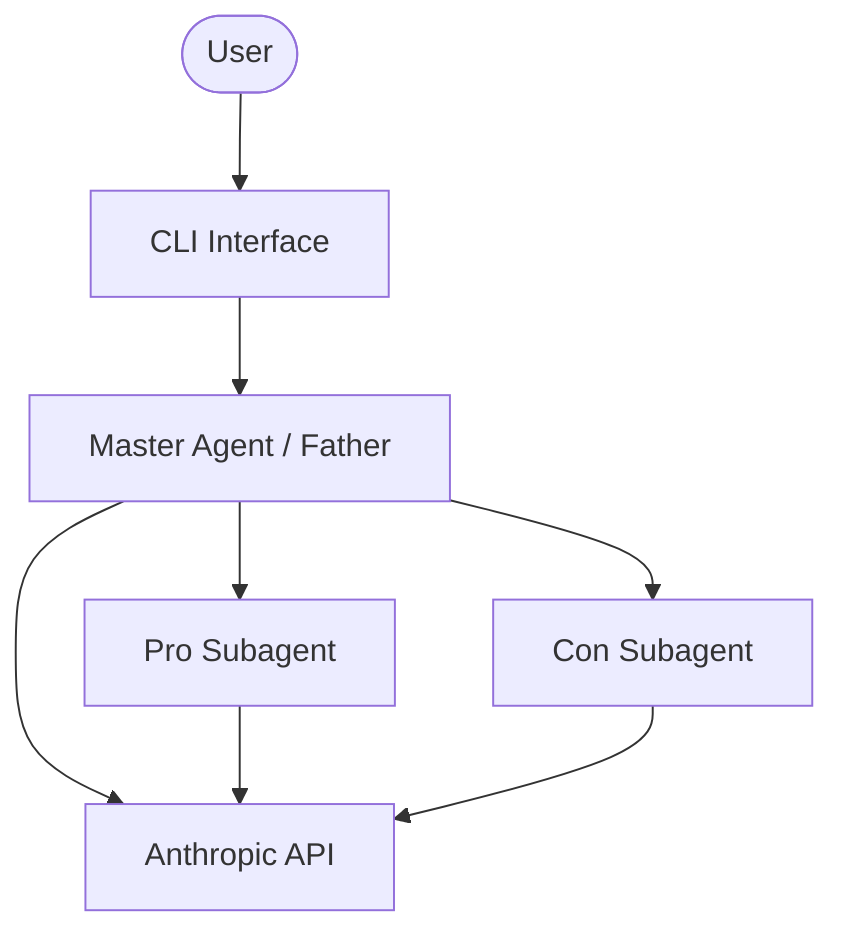
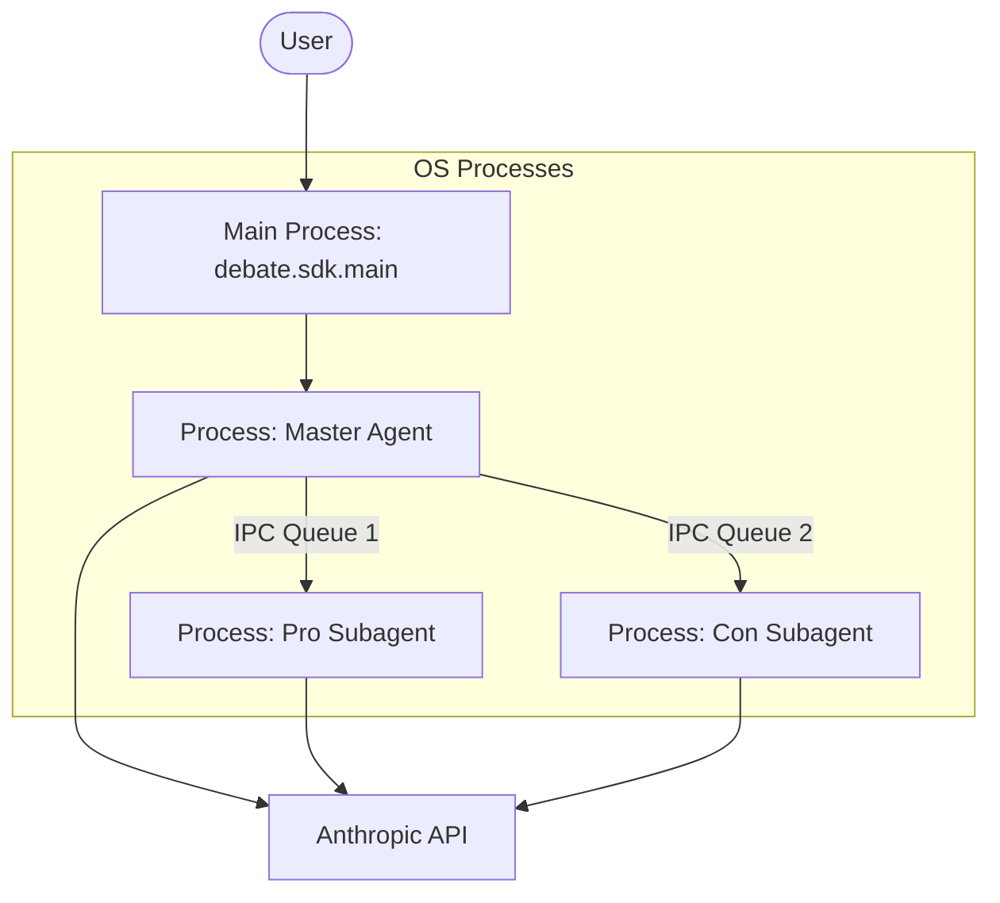
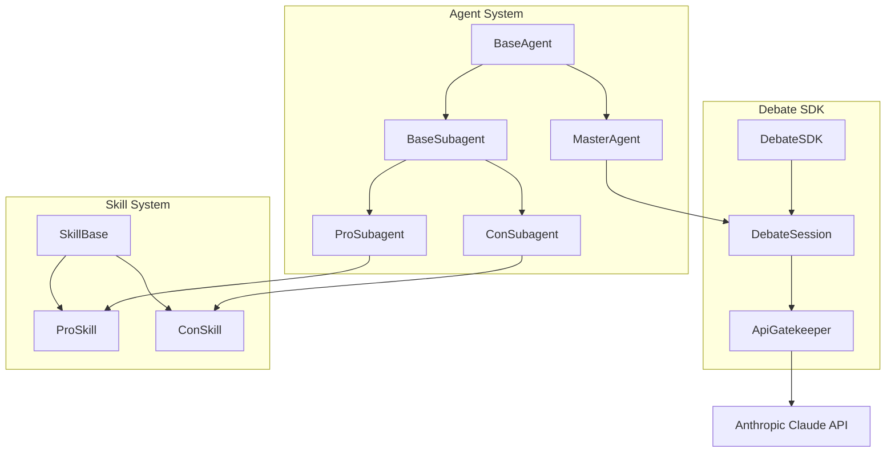

# Technical Plan (PLAN)
## Multi-Agent AI Debate System

### 1. C4 Diagrams

#### Context Diagram

#### Container Diagram

#### Component Diagram

### 2. UML Class Hierarchy
- `BaseAgent` (abstract)
  - `MasterAgent(BaseAgent)` — judge role
  - `BaseSubagent(BaseAgent)` — abstract child
    - `ProSubagent(BaseSubagent)`
    - `ConSubagent(BaseSubagent)`
- `ApiGatekeeper`
- `DebateSDK` (single entry point)
- `DebateSession`
- `RoundResult`
- `Verdict`
- `SkillBase` (abstract)
  - `ProSkill(SkillBase)`
  - `ConSkill(SkillBase)`
- `RouterSkill`
- `WatchdogMixin`
- `LoggingMixin`
- `IPCMixin`

### 3. IPC Protocol Design
- **Format**: JSON serialized strings (enforced by Pydantic schema validation).
- **Channels**: Standard `multiprocessing.Queue` objects serving as FIFO queues.
- **Routing**: `Child → Father → Child`. No direct communication between Pro and Con.

### 4. Architectural Decision Records (ADRs)
- **ADR-001**: Why separate OS processes (true IPC, not threads) - To fulfill assignment constraints and properly test strict IPC boundaries and serialization.
- **ADR-002**: Why FIFO/Queue for IPC (vs Sockets, Signals) - Simplest robust, built-in mechanism in Python's `multiprocessing` library, offering cross-platform support.
- **ADR-003**: Why Father-mediated communication - Required by the assignment for explicit orchestration and ensures that the judge observes all arguments.
- **ADR-004**: Why JSONL for logs - Append-safe, robust against single-line corruption, and easily parseable by standard tooling.
- **ADR-005**: Why `uv` over `pip` - Provides faster, deterministic lockfile management for project setup and dependency resolution.
- **ADR-006**: Why TDD with 85% coverage - Serves as a quality gate ensuring maintainability and adherence to academic requirements.

### 5. API Interface
The system will be accessed externally through a single entry point:
- `DebateSDK(topic: str, config_path: str)`: Initializes the core components.
- `run_debate() -> Verdict`: Orchestrates the debate and yields a verdict.
- `get_transcript() -> list[RoundResult]`: Fetches debate history.
- `get_queue_status() -> QueueStatus`: Retrieves the state of the API Gatekeeper.

### 6. Data Schemas
- `DebateMessage`: Represents a single IPC transmission containing `message_id`, `sender`, `recipient`, `content`, `evidence`, etc.
- `RoundResult`: Captures a matched set of Pro argument and Con counter-argument.
- `Verdict`: Captures the judge's final decision, scores, and reasoning.
- `LogEntry`: Standardized representation of logged events (e.g., API calls, IPC sends/receives).
